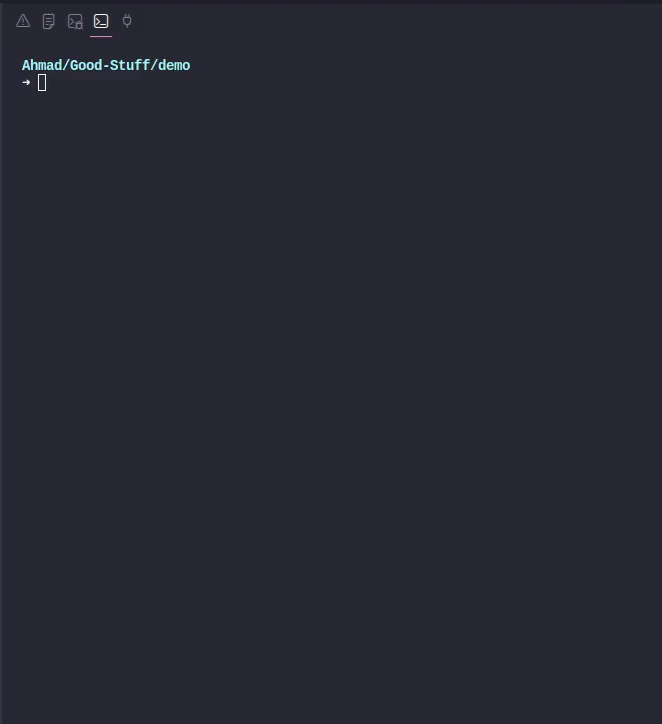

# TestGen CLI

> AI-powered test generation for your codebase. Generate comprehensive unit tests for PHP, JavaScript, and TypeScript with a single command.

[](https://www.npmjs.com/package/testgen-cli)
[](https://opensource.org/licenses/MIT)

---

## 🚧 Early Access Notice

**This is an early-access technical preview of the TestGen CLI.**

The API backend will go live shortly — your CLI will start generating tests automatically once the service is activated. We're excited by the early interest and working hard to get the API online!

**What to expect:**
- ✅ CLI installation and setup works now
- ⏳ Test generation will be available once API is live
- 📧 Follow [@Ahmad-Tayh2](https://github.com/Ahmad-Tayh2) for updates

Thank you for your patience and support! 🙏

---



## Features

- 🤖 **AI-Powered**: Leverages advanced LLMs to generate intelligent test cases
- 🌐 **Multi-Language**: Supports PHP (PHPUnit), JavaScript (Jest), and TypeScript (Jest)
- ⚡ **Fast**: Generates tests in seconds
- 📝 **Comprehensive**: Creates thorough test coverage with edge cases
- 🎨 **Review & Edit**: Shows diff before saving, allowing you to review and edit

## Installation

```bash
npm install -g testgen-cli
```

## Quick Start

1. **Login to your account:**

```bash
testgen login
```

2. **Generate tests for a file:**

```bash
# PHP
testgen generate src/UserService.php

# JavaScript
testgen generate src/utils/helpers.js

# TypeScript
testgen generate src/components/Button.tsx
```

3. **Check your usage:**

```bash
testgen status
```

## Supported Languages & Frameworks

| Language   | Test Framework | File Extensions |
| ---------- | -------------- | --------------- |
| PHP        | PHPUnit        | `.php`          |
| JavaScript | Jest           | `.js`, `.jsx`   |
| TypeScript | Jest           | `.ts`, `.tsx`   |

### Config File

Authentication tokens and preferences are stored in:

```
~/.testgen/config.json
```

This file is automatically created and managed by the CLI.

## Development

See [CONTRIBUTING.md](CONTRIBUTING.md) for development setup and guidelines.

### Quick Start for Development

```bash
# Clone the repository
git clone https://github.com/Ahmad-Tayh2/testgen-cli.git
cd testgen-cli

# Install dependencies
npm install

# Build
npm run build

# Link for local testing
npm link

# Use locally
testgen --help
```

## Troubleshooting

### "Failed to connect to API"

1. Check if `TESTGEN_API_URL` is set correctly
2. Verify the API is running and accessible
3. Check your internet connection

### "Authentication failed"

1. Run `testgen login` again
2. Ensure your credentials are correct
3. Check if your account is active

### "File too large"

The maximum file size is 5MB. Consider breaking down large files into smaller modules.

## Contributing

We welcome contributions! Please see [CONTRIBUTING.md](CONTRIBUTING.md) for details.

## License

[MIT](LICENSE)

## Support

- 🐛 [Report bugs](https://github.com/Ahmad-Tayh2/testgen-cli/issues)
- 💡 [Request features](https://github.com/Ahmad-Tayh2/testgen-cli/issues)
- 📖 [Documentation](https://github.com/Ahmad-Tayh2/testgen-cli#readme)

## Links

- [npm Package](https://www.npmjs.com/package/@testgen/cli)
- [GitHub Repository](https://github.com/Ahmad-Tayh2/testgen-cli)
- [Issue Tracker](https://github.com/Ahmad-Tayh2/testgen-cli/issues)

---

Made with ❤️ by the TestGen team
